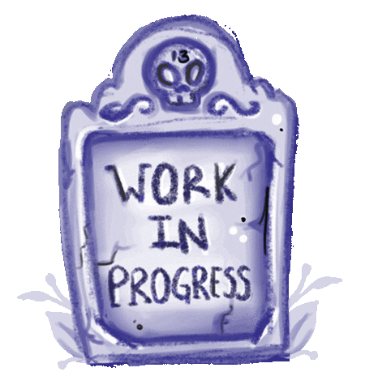

# Personal Postmortems

[](https://giphy.com/stickers/yeti-yk-ykanimation-S5KpKuf56TAw25wmPq)

People are lazy. Let's just get that out of the way. *Because* people are lazy, if we want to improve, we need some structure and accountability. Postmortem documentation is a great way to help a team learn and be accountable. To expand the team benefits of postmortems, I've modified software postmortem processes to be more personal and focused on individual growth.

Before we dive into what a personal postmortem is, let's lay some groundwork. Software developers are cute and like to use (*cough* steal *cough*) fun terminology. Outside the software world, [a postmortem](https://en.wikipedia.org/wiki/Autopsy) is a synonym for "autopsy" which means cutting open dead people to figure out how they died.

> The term "post-mortem" derives from the Latin for post, meaning "after" and mortem meaning "death". The principal aims of an autopsy is to determine the cause of death, mode of death, manner of death, the state of health of the person before he or she died, and whether any medical diagnosis and treatment before death was appropriate.

In software land, we treat our code as a person and pretend that person died whenever there's a customer-impacting issue. What happened that caused last week's software outage? Could we have done anything to prevent it? Were we alerted that something was broken or dead before our customers discovered the rotting skeleton in our closet? After answering these questions, ideally, a team will document their findings in a formal document template (usually chosen by the company in question) and lay out a plan for fixing the underlying issue to keep it from happening again. That's a postmortem!

Reactive postmortems like I've just described is the lowest rung on the ladder of postmortems. It's a solid step above sweeping problems under the rug, but we can do better. The next postmortem evolution is what [the Scrum world calls a "retrospective."](https://www.scrum.org/resources/what-is-a-sprint-retrospective). Retrospectives usually happen at the end of a project and aren't a reaction to something going wrong. The team gets together, brings their notes/code, and goes over what was successful and unsuccessful about the project now that it's completed or cancelled. Generally, a similar structure is followed to reactive postmortems where some sort of formal document or chart is filled out and a plan is concocted for how to do better next time.

Awesome! Let's take it one step further. The final evolution of postmortems doesn't involve an entire team. Instead, there's only one writer: you. You sit down and follow a document format reflecting on what *you* did, how *you* felt, and what *you* learned. It sounds a bit scarier when there's no "team" title to hide behind, right? "There's no growth in the comfort zone!"

Like dissecting cadavers, personal postmortems aren't for the faint of heart. Writing and sharing a personal postmortem doc takes some serious effort, reflection, and humility. Sure, you can write a postmortem doc and keep it to yourself in some folder on your desktop. That's still a solid step above not doing any self reflection. But, to get the full benefit of personal postmortems, you need to share the final doc with your team. Modeling vulnerability by openly sharing your challenges in addition to your triumphs leads to more rapid personal progress and a healthier team culture. If everyone on your team feels comfortable with experimentation and learning from potential failure, there'll be more collaboration, better discussion, and healthier code. Boom! High score!

It's important to note that personal postmortems don't need to be limited to when things go wrong or when a major project is finished/cancelled. The whole point is to reflect on your experience to maximize your learning and then share that newfound knowledge with your team. A postmortem discussing a conference you attended or a feature you added is just as useful as one discussing the time you set your production server on fire because you pressed "deploy" while half asleep. Just keep it within reason. You probably don't need to write a postmortem every time you do a one-line bug fix.

To nobly help the world, I took the template I use when writing my personal postmortems, filled it with explanatory comments, and pasted it below ([and in a separate file which displays better on mobile devices](template-demo.md)). It's simple and can be expanded if needed, but remember and apply the guiding principle of [Bullet Journaling](https://bulletjournal.com/): Keep things simple enough that you don't feel overwhelmed or demotivated. The point is to get things on the page.

Since most postmortems you write will contain proprietary corporate info, I recommend setting up a version controlled repository inside your company's source code management just for your postmortems. That way, your files are all in one sharable place and you can track changes. Maybe your coworkers will even make a PR against your docs to add a positive outcome you'd forgotten to mention!

Without further ado, let's dig in!

```
# (Put a Catchy Postmortem Title Here)

## Summary

Write a brief, one-paragraph summary of what happened/what you worked on. Put enough detail that someone can
skim and quickly understand what's going on but don't bog things down with technical details or griping.
Try to be objective. When referencing yourself, either speak in the third person or make it very clear who
wrote the document. "I" or "me" might not make sense to someone else later on.

## What Didn't Go Well

Give an overview of what didn't go well. Use a list for better readability. If things really didn't go well,
it's natural to have negative emotions, but don't use this section to rant. Look at data and facts. Don't be
afraid to mention people by name, but try not to throw people under the bus. Examples below.

- Jesse overpromised and didn't deliver the feature on time
- Jesse got in an argument with a teammate which ended up being silly because we were actually on the same page
- Jese isn't entirely proud of the code he ended up writing (lots of "here be dragons" comments)

## What Went Well

For this section, format similarly to the "What Didn't Go Well" section, but instead talk about the things
that *did* go well. Don't try to use this section to override or hedge the "What Didn't Go Well" section. Be
objective, factual, and aware of your latent emotions. Remember as you write that a postmortem doc is just as
much about celebrating successes and lessons learned as it is about identifying shortcomings and potential
growth areas. Loose examples follow. Be specific in your actual postmortem.

- Jesse learned a lot about a new technology
- We have a more defined PR process in place
- Jesse added a lot of explanatory comments to our code

## Results

Make a list of lessons you learned and what you're going to do differently in the future. Also list (and link
to if possible) any files, documents, etc. that came about as a result of whatever your postmortem is
discussing. Bullets are your friend here.

- Jesse should be more realistic in the future when deciding how much work he can take on in a set amount of time. It would have been better if I'd only promised to deliver parts X and Y before the end of the month instead of also including Z.
- Our documentation could use some improvement and it doesn't take much effort. Jesse was able to create [a new onboarding page]() with links to six other pages to help our interns get up to speed.
- [A not-yet-closed PR]() that still needs a couple reviews.
- [A new web page]() explaining the feature to our customers.

## Appendix

All appendix sections are optional and should only be included if relevant.

### Links

Put a list of relevant links here for easy reference. Some generic examples are shown below.

- [A link to a PR discussion]()
- [A wiki page outlining a design or timeline]()
- [A web page outlining a conference you went to]()

### Timeline

Fill this section with a list of timestamps showing what happened in what order. In most cases, you likely
won't need to be more granular than a day, but make sure you include the year for future readers.

- [4/15/2020] Jesse was given the task and started researching
- [4/16/2020] Jesse pair programmed with someone
- [4/21/2020] Jesse fought with a technology
- [4/23/2020] Jesse created the final PR
```

And there you have it! Give a personal postmortem a shot or two and see how it goes over. I'd bet you'll feel more empowered and able to tackle challenges once you've written a few. When you're comfortable with the general idea of the template sections, here's [a minimal template](https://raw.githubusercontent.com/jessemillar/blog/master/personal-postmortems/template.md) for quickly filling out postmortems.

Now, go have fun examining some cadavers!

[](https://giphy.com/stickers/wip-work-in-progress-eani13-hS9x8qV9bCrBBHx2rq)

Hey! You're still reading! For extra credit, if you use [Neovim](https://github.com/neovim/neovim) or similar, you can save [the simplified template I included above](template.md) as a file and then put something like this snippet in your `.vimrc` file to automatically load the template anytime you create a new file prefixed with `postmortem-`:

```
au BufNewFile postmortem-*.md 0r ~/.templates/postmortem.md
```

Be sure to specify the correct save location for the template file. I have a segment of [my dotfiles](https://github.com/jessemillar/dotfiles) that automatically puts a few useful templates in `~/.templates`.

Enjoy!
